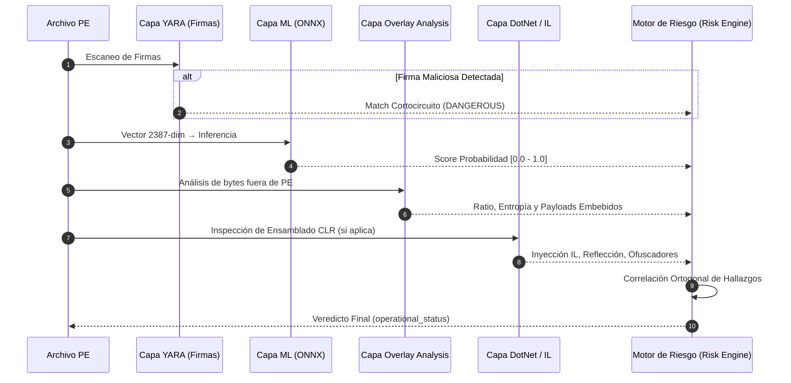

# Arquitectura de Deep Learning, Redes Neuronales y Sistema Híbrido Multicapa en ShadowNet Defender

Este documento explica de forma **técnica pero clara, estructurada y accesible** cómo está diseñado el sistema de Deep Learning, las Redes Neuronales y la **Arquitectura Híbrida Multicapa** dentro de **ShadowNet Defender**.

---

## 1. Visión General: El Rol de la Inteligencia Artificial y la Defensa Multicapa

ShadowNet Defender combina el análisis estático tradicional con **Deep Learning (Aprendizaje Profundo)**, **Heurísticas Avanzadas** e **IA Generativa**. 

En lugar de depender exclusivamente de un modelo único o de firmas estáticas (hashes) que los atacantes pueden evadir fácilmente, el sistema implementa una **estrategia de defensa en profundidad**: el archivo pasa por múltiples capas analíticas independientes cuyo veredicto final es sintetizado por un Motor de Correlación de Riesgo.

```mermaid
flowchart TD
    A[📁 Archivo PE .exe/.dll] --> B1[🛡️ Capa 1: Reglas YARA]
    A --> B2[🔬 Capa 2: Extracción 2381-dim + OVERLAY_6 + Normalización]
    B2 --> C2[🧠 Capa 3: Red Neuronal MLP ONNX]
    A --> B3[🔍 Capa 4: Overlay Analysis]
    A --> B4[⚙️ Capa 5: DotNet & IL Behavioral]
    
    B1 --> R[📊 Capa 6: Risk Engine / Correlación]
    C2 --> R
    B3 --> R
    B4 --> R
    
    R --> F[🤖 Capa 7: LLM cloud Groq/Gemini + Template offline<br/>(cascada Tri-Fallover)]
    F --> G[📋 Reporte Explicativo XAI]
```

---

## 2. ¿Por qué el Sistema es Híbrido y Multicapa?

### 💡 Justificación Técnica y Humana

Ninguna técnica individual de detección de malware es perfecta contra todos los vectores de evasión existentes:

| Técnica | Fortaleza Principal | Vector de Evasión / Debilidad |
| :--- | :--- | :--- |
| **YARA (Firmas)** | Precisión milimétrica en familias conocidas | Falla ante polimorfismo y variantes inéditas |
| **ML / Deep Learning** | Generalización *Zero-Day* ante variantes | Vulnerable a *Overlay Payloads*, empaquetado y evasión estadística |
| **Overlay Analysis** | Detecta contenido oculto al final del ejecutable | Solo aplica a binarios con estructura PE |
| **DotNet & IL Analysis** | Analiza la intención del código CLR sin ejecutarlo | Solo aplica a binarios compilados en .NET |

---

### 🛡️ Los 4 Pilares del Diseño Híbrido Multicapa

1. **Cobertura Ortogonal (Complementariedad):**
   Las capas no compiten; se complementan. Un atacante puede crear un malware sin firma YARA que logre engañar a la Red Neuronal (score ML bajo, p. ej. 0.09 en `sample1.exe`), pero el **Overlay Analysis** detectará que el 98.7% del archivo es un bloque de datos cifrados de alta entropía (caso verificado en `sample1.exe`).

2. **Independencia y Tolerancia a Fallos:**
   Si una capa falla o no aplica (por ejemplo, si el binario no es .NET), el pipeline no se detiene. Continúa evaluando con las fases restantes (*Graceful Degradation*).

3. **Divergencia Operativa (`operational_status` vs `label` ML):**
   A diferencia de los antivirus tradicionales que dependen de un único veredicto, el **Risk Engine** de ShadowNet Defender puede clasificar un archivo como `DANGEROUS` incluso si la Red Neuronal dice `BENIGN`, siempre que las capas de overlay o YARA detecten indicadores críticos.

4. **Cadena de Evidencia Auditable:**
   El sistema no es una "caja negra". Cada capa aporta evidencias forenses concretas (reglas YARA activadas, ratio de overlay, tokens de metadatos IL, SHAP values) para que el analista humano entienda la razón exacta del diagnóstico.

---

## 3. Deep Learning en el Proyecto

### 📌 ¿Qué se usa?
El subsistema de Deep Learning abarca componentes de código, artefactos pre-entrenados y servicios de inferencia:

1. **Artefactos del Modelo (`models/`):**
   - `shadow_net_sorel_7m_v1.1.onnx`: Red neuronal entrenada y optimizada para producción (~5.3 MB de pesos, sin archivo `.data`).
   - `scaler_ember_v1.1.pkl`: Objeto `StandardScaler` con media ($\mu$) y desviación ($\sigma$) para 2,381 dimensiones EMBER.
   - `scaler_overlay_v1.1.pkl`: `StandardScaler` para las 6 señales OVERLAY.
   - `model_manifest.json`: Registro oficial de versión (`v1.1.0`), umbrales e integridad mediante hashes SHA-256 (modelo anterior respaldado en `models/legacy_2381/`).

2. **Motores de Inferencia y Explicabilidad (`models/inference.py`, `core/`):**
   - `models/inference.py`: Ejecución de inferencia ligera con `onnxruntime` (construye `ShadowNetFeatures_v1.1 = EMBER_2381 + OVERLAY_6 = 2387` vía `models/features_v1_1.py`).
   - `core/explain/shap_explainer.py`: Algoritmo SHAP para auditoría de características (2 387 nombres).
   - `core/llm/`: Servicio de integración LLM vía cascada cloud Groq (`openai/gpt-oss-20b`) → Gemini (`gemini-3.5-flash-lite`) → TemplateExplainer offline, todo con SDK `openai` y endpoint OpenAI-compatible (ver `docs/TriFallover_Groq_Gemini_Template.md`).

3. **Dataset y Pipeline de Entrenamiento:**
   - Entrenado en PyTorch (torch 2.4.1+cu121) con GPU NVIDIA Tesla P100 sobre **7.0 millones de muestras** SOREL-20M (seed 42; 4 187 321 malware / 2 812 679 benignos), split temporal 6.3M train / 0.7M val, 2 épocas, Adam lr=1e-3, `BCEWithLogitsLoss`, batch 8192, threshold 0.5.

---

### 💡 ¿Por qué se usa?
- **Detección Zero-Day:** El modelo no memoriza nombres ni hashes; aprende representaciones latentes abstractas del malware.
- **Portabilidad y Rendimiento:** PyTorch requiere librerías pesadas (~700 MB) y GPU. Exportar a **ONNX Runtime** reduce la huella a **~5 MB** y logra inferencias en **< 15 ms** utilizando únicamente la CPU.
- **Superación de Métodos Previos:** En la versión V2 se usaba *LightGBM* (árboles de decisión). La migración en V3/V4 a una Red Neuronal Profunda (DNN) mejoró la capacidad de generalización y redujo los falsos positivos en software legítimo complejo.

---

### ⚙️ ¿Cómo se usa?
1. **Extracción:** Al recibir un binario, `PEFeatureExtractor` genera un vector crudo EMBER de 2381 dimensiones (ruta canónica `extractors/ember_features.py`, LIEF).
2. **Estandarización:** Se deriva OVERLAY_6 del bloque General y se aplica un `StandardScaler` por bloque ($Z = \frac{x - \mu}{\sigma}$) → vector 2387.
3. **Inferencia ONNX:** El vector 2387 entra a `shadow_net_sorel_7m_v1.1.onnx` vía `onnxruntime.InferenceSession` (sigmoid incluido → probabilidad).
4. **Veredicto:** El modelo retorna una probabilidad continua entre `0.0` (Benigno) y `1.0` (Malware).

---

## 4. Red Neuronal Principal: Perceptrón Multicapa (MLP / DNN)

### 📌 ¿Qué se usa?
La arquitectura principal es un **Perceptrón Multicapa (MLP)** o Red Neuronal Feedforward Profunda con topología en "embudo cónico" (*funnel architecture*).

#### Composición del Vector de Entrada (2387 Dimensiones = 2381 EMBER + 6 OVERLAY):
- **Histograma de Bytes (256 dims):** Frecuencia estadística de bytes `0x00` a `0xFF`.
- **Entropía de Bytes (256 dims):** Medición de desorden local con ventana deslizante de 2048 bytes.
- **Strings e IoCs (104 dims):** Patrones de URLs, comandos PowerShell, rutas de registro, claves criptográficas.
- **Metadatos Generales PE (10 dims):** Tamaños, número de secciones, flags generales.
- **Cabeceras PE (62 dims):** Categóricos hasheados + 11 numéricos (canónico EMBER v2).
- **Análisis de Secciones (255 dims):** Permisos RWX, nombres, entropía por sección y discrepancias VirtualSize/RawSize (FeatureHasher).
- **Imports IAT (1280 dims):** Feature Hashing (murmurhash: 256 librerías + 1024 funciones).
- **Exports (128 dims):** Feature Hashing de funciones exportadas.
- **Data Directories (30 dims):** Tamaño + RVA de 15 directorios.
- **OVERLAY_6:** `slack_ratio`, `slack_bytes_log`, `file_size_log`, `imports_log`, `has_cert`, `stub_overlay_pattern` (derivadas del bloque General, escaladas aparte).

#### Estructura de la Red Neuronal:
```text
Entrada (2387 neuronas - Vector Z-Score)
   │
   ▼
[Capa Oculta 1] ── Dense(512) ──► BatchNorm1d ──► ReLU ──► Dropout(p=0.3)
   │
   ▼
[Capa Oculta 2] ── Dense(256) ──► BatchNorm1d ──► ReLU ──► Dropout(p=0.2)
   │
   ▼
[Capa Oculta 3] ── Dense(128) ──► BatchNorm1d ──► ReLU ──► Dropout(p=0.1)
   │
   ▼
[Capa Salida]   ── Dense(1)   ──► Sigmoid ──► Score P(Malware) ∈ [0.0, 1.0]
```

---

### 💡 ¿Por qué se usa?
- **Adecuación al tipo de datos:** Las características extraídas son numéricas y tabulares. Las redes MLP son la arquitectura estándar en la literatura científica para este tipo de representaciones (como en los benchmarks EMBER y SOREL-20M).
- **Batch Normalization (`BatchNorm1d`):** Estabiliza y acelera el aprendizaje al normalizar las activaciones internas de cada mini-batch.
- **Activación `ReLU`:** Evita el problema del gradiente evanescente (*vanishing gradient*) y mantiene alta eficiencia computacional.
- **`Dropout` Progresivo (0.3 → 0.2 → 0.1):** Desactiva aleatoriamente neuronas durante el entrenamiento. Al ser mayor cerca de la entrada y menor cerca de la salida, evita que la red dependa en exceso de características específicas (previene *overfitting*).
- **`Sigmoid` en la Salida:** Transforma la salida final en un valor entre $0$ y $1$, directamente interpretable como probabilidad matemática.

---

### ⚙️ ¿Cómo se usa?
La red procesa la información de forma secuencial hacia adelante (*forward pass*):
1. Recibe las 2387 entradas escaladas (1 388 801 parámetros).
2. La **Capa 1** (512 neuronas) extrae combinaciones iniciales de bajo nivel.
3. La **Capa 2** (256 neuronas) comprime la representación a patrones de nivel medio (ej. combinaciones de imports sospechosos + entropía alta).
4. La **Capa 3** (128 neuronas) sintetiza las señales en conceptos abstractos de amenaza.
5. La **Capa de Salida** emite la probabilidad final en $< 15\text{ ms}$.

---

## 5. Las Capas del Pipeline Híbrido Multicapa

Para lograr una evaluación integral, `core/engine.py` ejecuta las siguientes capas analíticas en orden:



1. **Capa YARA (Firmas Rápidas):**
   - **Qué hace:** Aplica reglas de firmas sobre los bytes raw del ejecutable.
   - **Por qué se usa:** Identifica de forma inmediata familias conocidas de ransomware, spyware o troyanos sin gastar recursos de cómputo adicionales. Si hay un match crítico, puede hacer cortocircuito en el pipeline.

2. **Capa ML / Deep Learning (Inferencia ONNX):**
   - **Qué hace:** Procesa el vector de 2387 características (2381 EMBER + 6 overlay) y genera la probabilidad estadística de maliciosidad.
   - **Por qué se usa:** Captura la estructura general del archivo y detecta variantes no vistas (*Zero-Day*).

3. **Capa Overlay Analysis (Análisis de Payloads Ocultos):**
   - **Qué hace:** Inspecciona los datos almacenados *después* del final de la última sección PE declarada.
   - **Por qué se usa:** Los atacantes suelen adjuntar archivos cifrados o executables secundarios al final del archivo para que el parser PE (y la Red Neuronal) no los analice. Esta capa mide la entropía del overlay y detecta magic bytes `MZ`.

4. **Capa DotNet & IL Behavioral Analysis (Infección en código .NET):**
   - **Qué hace:** Analiza los metadatos CLR e instrucciones IL de binarios compilados en .NET sin ejecutarlos.
   - **Por qué se usa:** Detecta técnicas de ofuscación (como ConfuserEx), llamadas a `VirtualAlloc`, inyección de código, llamadas reflectivas (`Assembly.Load`) o robo de credenciales en aplicaciones .NET.

5. **Capa Risk Engine (Motor de Correlación de Riesgo):**
   - **Qué hace:** Reúne las salidas de todas las capas anteriores y aplica reglas de correlación ponderada.
   - **Por qué se usa:** Garantiza que el veredicto final (`operational_status`: `CLEAN`, `SUSPICIOUS`, `DANGEROUS`) sea robusto y resistente a evadir una sola técnica.

---

## 6. Red Neuronal Secundaria: Arquitectura Transformer (LLM)

### 📌 ¿Qué se usa?
Integración con modelos de lenguaje generativos (*Large Language Models*) basados en la arquitectura **Transformer**, vía **cascada cloud Groq (`openai/gpt-oss-20b`) → Gemini (`gemini-3.5-flash-lite`) → TemplateExplainer offline**, todo con SDK `openai` sobre endpoints OpenAI-compatibles (Groq: `api.groq.com/openai/v1`, Gemini: `generativelanguage.googleapis.com/v1beta/openai/`). Durante el desarrollo se implementó la eliminación del stack local (Antes: Ollama local, Ahora: solo nube con fallback determinístico offline; ver `docs/TriFallover_Groq_Gemini_Template.md`).

---

### 💡 ¿Por qué se usa?
- **Explicabilidad Forense (XAI):** Un score numérico como `0.982` o un veredicto de la capa de riesgo indica la maliciosidad, pero un analista de seguridad necesita comprender **por qué** se tomó esa decisión.
- **Traducción Contextual:** El LLM recibe los metadatos del binario, las evidencias de las capas multicapa y los valores **SHAP** (que indican qué características pesaron más en el veredicto) y redacta un reporte claro en lenguaje natural con recomendaciones de remediación.

---

### ⚙️ ¿Cómo se usa?
1. Se calcula la predicción del MLP, las evidencias multicapa y los valores SHAP correspondientes.
2. `prompt_builder.py` construye una plantilla con la información forense recopilada (`extract_scan_summary` + reglas de autoridad/familia).
3. `GroqClient`/`GeminiClient` (vía `core/llm/base_client.py` OpenAI-compatible) envía el prompt a la nube; ante 429/timeout/5xx la cascada conmuta automáticamente a `TemplateExplainer` offline.
4. El LLM (o el fallback determinístico) devuelve un diagnóstico estructurado en JSON con el resumen del comportamiento y las acciones recomendadas.

---

## 7. Resumen Comparativo de Redes Neuronales y Capas

| Componente / Capa | Tipo de Tecnología | Rol Principal en el Sistema | Salida / Resultado |
| :--- | :--- | :--- | :--- |
| **Capa 1: YARA** | Firmas / Reglas deterministas | Detección inmediata de familias conocidas | Match de Regla / Pass |
| **Capa 2: Red Principal (MLP)** | **Red Neuronal Profunda (DNN)** | Clasificación de estructura PE y Zero-Day | Probabilidad $P(\text{Malware}) \in [0.0, 1.0]$ |
| **Capa 3: Overlay Analysis** | Análisis heurístico de entropía | Detección de payloads cifrados adjuntos | Score de riesgo de overlay (0–100) |
| **Capa 4: DotNet / IL** | Parsing de metadatos CLR | Identificación de ofuscadores e inyección IL | Perfil de riesgo .NET / Evidencia IL |
| **Capa 5: Risk Engine** | Motor de correlación de reglas | Síntesis ponderada ortogonal | `operational_status` (`CLEAN`/`SUSPICIOUS`/`DANGEROUS`) |
| **Capa 6: Red Secundaria (LLM)** | **Transformer Autoregresivo** | Explicabilidad (XAI) y reporte en español | Diagnóstico explicativo narrativo |

---

> 📝 **Nota sobre Mantenimiento:** Los artefactos del modelo ONNX y los escaladores Z-Score se encuentran verificados y congelados en la versión `v1.1.0`. Toda modificación a la arquitectura o reentrenamiento debe registrarse en `models/model_manifest.json`.
