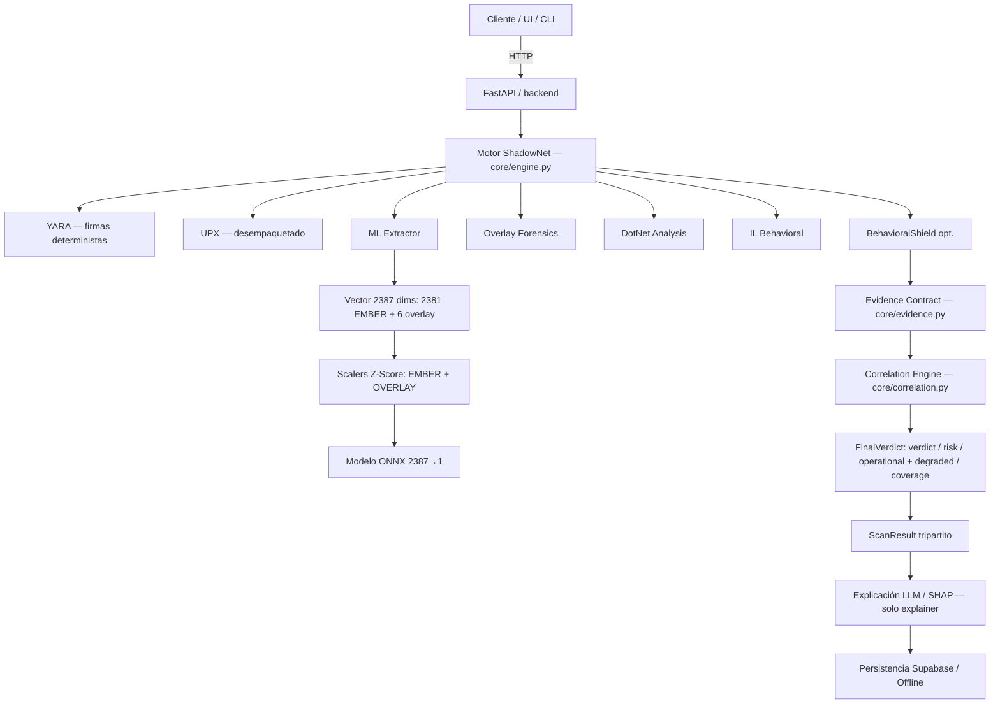

# Shadow-Net: Defender

**Hybrid multi-layer malware detection — deep learning, advanced static analysis, and explainable heuristic correlation**

<div align="center">


</div>

> *"Un enfoque científico para la detección proactiva de amenazas cibernéticas, cerrando la brecha entre la teoría académica y la defensa práctica."*

### Licencia Privada — Proyecto Académico Investigativo

- Licencia privada de investigación.
- Primer producto oficial de **SHADOW-NET**.
- Autores: **Ivan Velasco (IVAINX_21)** y **Santiago Cubillos (VANkLEis)**.
- Este software **no es open-source**.
- Uso permitido únicamente para fines académicos e investigativos; no se permite distribución, sublicenciamiento ni uso comercial sin autorización expresa y escrita de los autores.

---

## Índice

| # | Sección | # | Sección |
|---|---------|---|---------|
| 1 | [Introducción](#1-introducción) | 17 | [API y Endpoints](#17-api-y-endpoints) |
| 2 | [Descripción del Proyecto](#2-descripción-del-proyecto) | 18 | [IA / Machine Learning](#18-inteligencia-artificial--machine-learning) |
| 3 | [Objetivos](#3-objetivos) | 19 | [Sistema de Detección Multicapa](#19-sistema-de-detección-multicapa) |
| 4 | [Problema que Resuelve](#4-problema-que-resuelve) | 20 | [Extracción de Características](#20-procesamiento-y-extracción-de-características) |
| 5 | [Características Principales](#5-características-principales) | 21 | [Integraciones Externas](#21-integraciones-externas) |
| 6 | [Arquitectura General](#6-arquitectura-general) | 22 | [Base de Datos](#22-base-de-datos) |
| 7 | [Flujo de Funcionamiento](#7-flujo-de-funcionamiento) | 23 | [Automatizaciones](#23-automatizaciones) |
| 8 | [Componentes del Sistema](#8-componentes-del-sistema) | 24 | [Pruebas](#24-pruebas) |
| 9 | [Tecnologías Utilizadas](#9-tecnologías-utilizadas) | 25 | [Métricas y Resultados](#25-métricas-y-resultados) |
| 10 | [Requisitos del Sistema](#10-requisitos-del-sistema) | 26 | [Casos de Análisis](#26-casos-de-análisis) |
| 11 | [Estructura del Proyecto](#11-estructura-del-proyecto) | 27 | [Seguridad](#27-seguridad) |
| 12 | [Instalación](#12-instalación) | 28 | [Limitaciones](#28-limitaciones) |
| 13 | [Configuración del Entorno](#13-configuración-del-entorno) | 29 | [Trabajo Futuro](#29-trabajo-futuro) |
| 14 | [Variables de Entorno](#14-variables-de-entorno) | 30 | [Documentación Adicional](#30-documentación-adicional) |
| 15 | [Ejecución del Proyecto](#15-ejecución-del-proyecto) | 31 | [Autores](#31-autores) |
| 16 | [Uso del Sistema](#16-uso-del-sistema) | 32 | [Licencia](#32-licencia) |

> **Detalle por módulo:** toda la documentación técnica vive en [`docs/`](docs/README.md) — este README es solo una vista de alto nivel.

---

## 1. Introducción

**ShadowNet Defender (SND)** es un sistema de ciberseguridad orientado a la **detección estática de malware** en ejecutables Windows (PE — *Portable Executable*). Cada binario se transforma en un vector EMBER de **2 381 dimensiones**, se deriva un bloque OVERLAY de **6 señales** (total **2 387**), cada bloque se normaliza con su propio scaler y el vector resultante se clasifica con un **MLP (`2387 → 512 → 256 → 128 → 1`)** exportado a ONNX.

De forma complementaria, un **pipeline heurístico multicapa** inspecciona overlays, secciones empaquetadas, firmas YARA y comportamientos .NET, y correlaciona todas las señales en un veredicto único. La explicabilidad se genera con **modelos de lenguaje en la nube (Groq / Gemini)** mediante una cascada resiliente con fallback offline.

> Para el contexto académico completo, ver [`docs/academico/01_resumen_ejecutivo.md`](docs/academico/01_resumen_ejecutivo.md) y [`docs/academico/03_modelo_sorel20m.md`](docs/academico/03_modelo_sorel20m.md).

---

## 2. Descripción del Proyecto

Suite completa de ciberseguridad compuesta por:

| Capa | Qué hace |
|------|----------|
| **Motor de análisis** | Orquestador híbrido (YARA, desempaquetado UPX, ML, forense de overlays, análisis DotNet/IL). |
| **Extractor de características** | Implementación alineada a EMBER 2.0 / SOREL-20M. |
| **Backend API** | FastAPI — expone análisis, explicabilidad y flujos SOC. |
| **Frontend / Desktop** | Electron — interfaz para usuarios finales y SOC. |
| **Automatización** | Webhooks de alertas y telemetría. |

---

## 3. Objetivos

**Objetivo general:** desarrollar un sistema de detección capaz de operar offline, analizar en profundidad ejecutables Windows (estática, heurística, ML y conductual ligera) y ofrecer explicabilidad total.

**Objetivos específicos alcanzados:**

- Extractor de 2 381 dimensiones compatible con EMBER 2.0 (entrada del modelo: 2 387 con OVERLAY_6).
- Entrenamiento del modelo v5 sobre 7M muestras SOREL-20M (seed 42, split temporal 6.3M/0.7M, 2 épocas).
- Pipeline híbrido resistente a empaquetado y evasión.
- Explicaciones generativas en la nube con cascada resiliente (sin dependencia local obligatoria).
- Autenticación y sincronización con Supabase (offline-first).

> Roadmap y pendientes: [`docs/auditorias/ToDo.md`](docs/auditorias/ToDo.md) · Progreso: [`docs/auditorias/PROGRESS.md`](docs/auditorias/PROGRESS.md)

---

## 4. Problema que Resuelve

Los antivirus clásicos dependen de un ciclo reactivo basado en firmas: detectan *quién es* el malware y fallan ante polimorfismo, metamorfismo, payloads en overlay, zero-days o técnicas *Living off the Land* (LotL).

ShadowNet Defender aplica **ML sobre análisis estático** y **heurística avanzada** para aprender patrones discriminantes — detecta amenazas nunca vistas por su **estructura y comportamiento**, no por su hash.

---

## 5. Características Principales

| Característica | Descripción |
|----------------|-------------|
| **Vector ML 2 387 dims** | 2 381 EMBER (histogramas de bytes, entropía, strings/IoCs, metadatos generales, cabeceras, hashing de imports/exports, data directories) + 6 OVERLAY (slack, tamaño, imports, certificado, patrón stub). |
| **Motor híbrido multicapa** | Reglas YARA + desempaquetado UPX + forense de overlays + análisis DotNet/IL. |
| **Motor de riesgo correlacionado** | Agrega evidencias por grupo y eleva el estado a `SUSPICIOUS` / `DANGEROUS` / `CRITICAL` sin depender ciegamente del ML. |
| **Inferencia CPU ligera** | Exportación ONNX + normalización Z-Score (inferencia pura < 50 ms). |
| **BehavioralShield (opcional)** | Capa dinámica para procesos vivos: inyecciones, networking, persistencia. |
| **Explicabilidad** | SHAP para atribución + LLM estructurado vía cascada cloud con fallback offline. |
| **Hardening del extractor** | Fallback por tamaño, muestreo distribuido, tolerancia a PEs corruptos. |

---

## 6. Arquitectura General

El sistema sigue **Clean Architecture** organizada en un **pipeline centrado en evidencias** — cada capa emite evidencias tipadas que un motor de correlación sintetiza en un veredicto final (sin *last writer wins*).



Durante el desarrollo se implementaron:

- **Evidence Contract** — cada capa emite `Evidence` con `score_raw` preservado, `score_norm 0–1`, `reliability`, `evidence_group` anti-doble-conteo y `status` (`OK / DEGRADED / UNAVAILABLE`) donde `UNAVAILABLE ≠ BENIGN`.
- **Correlation Engine** — agrega por grupo con pesos por confiabilidad, aplica umbrales y reglas de contradicción, y produce `FinalVerdict` con `Verdict / Risk / Operational` separados y métricas de cobertura.
- **Integración YARA determinista** — 4 familias / 15 reglas con veto `high/critical → MALICIOUS`, `timeout → DEGRADED`, nunca `BENIGN` silencioso.

> Detalle técnico: [`docs/arquitectura/DOCUMENTACION_TECNICA_INTEGRAL.md`](docs/arquitectura/DOCUMENTACION_TECNICA_INTEGRAL.md) · Evidencias y correlación: [`docs/arquitectura/F2_EVIDENCE_CORRELATION.md`](docs/arquitectura/F2_EVIDENCE_CORRELATION.md) · YARA: [`docs/arquitectura/F3_YARA_INTEGRATION.md`](docs/arquitectura/F3_YARA_INTEGRATION.md) · Persistencia y remediación: [`docs/arquitectura/F4_PERSISTENCE.md`](docs/arquitectura/F4_PERSISTENCE.md)

---

## 7. Flujo de Funcionamiento

| Paso | Etapa | Qué ocurre |
|------|-------|------------|
| 1 | **Recepción** | El binario PE llega vía API / CLI / subida. |
| 2 | **Determinismo** | YARA produce evidencia determinista (`UNAVAILABLE` no es `BENIGN`). |
| 3 | **Desempaquetado** | UPX si el binario está compactado. |
| 4 | **Machine Learning** | `PEFeatureExtractor` → vector 2 381 → OVERLAY_6 → vector 2 387 → scalers → ONNX → evidencia ML con `score_raw` preservado. |
| 5 | **Capas forenses** | Overlay / DotNet / IL emiten evidencias independientes. |
| 6 | **Correlación** | El Correlation Engine agrega por grupo, aplica umbrales y vetos, y produce `FinalVerdict` con cobertura y contradicción explícitas. |
| 7 | **Explicabilidad** | SHAP o LLM en la nube **solo explica**, nunca decide. |
| 8 | **Automatización** | Estados relevantes disparan webhooks de telemetría y alertas. |

---

## 8. Componentes del Sistema

| Directorio | Responsabilidad |
|------------|-----------------|
| `core/` | Motor híbrido, LLM, riesgo y automatización. |
| `extractors/` | Ingeniería de características por bloques (bytes, entropía, imports, exports, cabeceras, strings). |
| `backend/app/` | API FastAPI. |
| `frontend/` + `ui/` | Interfaz de escritorio (Electron / React). |
| `models/` | `shadow_net_sorel_7m_v1.1.onnx` + `scaler_ember_v1.1.pkl` + `scaler_overlay_v1.1.pkl` + `model_manifest.json` (modelo anterior respaldado en `models/legacy_2381/`). |
| `security/` | Reglas YARA y cuarentena. |
| `tests/` | Suite unitaria, integración y propiedades (Hypothesis). |
| `docs/` | Documentación por dominio — ver [índice de docs](docs/README.md). |

---

## 9. Tecnologías Utilizadas

### Backend y Core ML

| Tecnología | Uso |
|------------|-----|
| **Python 3.11** | Lenguaje del motor y backend. |
| **FastAPI / Uvicorn** | APIs REST asíncronas. |
| **ONNX Runtime** | Inferencia CPU sin PyTorch en producción. |
| **pefile / yara-python** | Forense PE y firmas. |
| **NumPy / scikit-learn** | Álgebra matricial y `StandardScaler`. |

### Inteligencia Artificial

| Tecnología | Uso |
|------------|-----|
| **PyTorch** | Entrenamiento offline de la DNN (exportada a ONNX). |
| **Groq / Gemini** (vía SDK `openai` + `response_format: json_object`) | LLM cloud con `TemplateExplainer` offline como fallback. |
| **SHAP** | Atribución de características para ONNX. |

### Automatización y Persistencia

| Tecnología | Uso |
|------------|-----|
| **Supabase (PostgreSQL + Auth)** | Historial de escaneos, cuarentena y alertas. |
| **Edge Functions (Deno + Nodemailer)** | Envío de alertas por SMTP. |

> Arquitectura profunda: [`docs/arquitectura/ARQUITECTURA_DEEP_LEARNING.md`](docs/arquitectura/ARQUITECTURA_DEEP_LEARNING.md) · PRD: [`docs/arquitectura/PRD.md`](docs/arquitectura/PRD.md)

---

## 10. Requisitos del Sistema

| Requisito | Especificación mínima |
|-----------|-----------------------|
| **SO** | Linux Ubuntu 22.04+ (recomendado) / Windows 11 |
| **Python** | `>= 3.11, < 3.12` |
| **RAM** | 4 GB (8 GB recomendado) |
| **Almacenamiento** | 500 MB libres (modelos LLM adicionales requieren más) |

---

## 11. Estructura del Proyecto

```text
Shadownet_Defender_Extractor_V2/
├── backend/          # API FastAPI
├── configs/          # Configuración y whitelists
├── core/             # Engine híbrido, LLM, riesgo, automatización
├── docs/             # Documentación por dominio
│   ├── academico/    # Artículos, tesis e investigación
│   ├── arquitectura/ # Diseño técnico, PRD y deep learning
│   ├── auditorias/   # Auditorías, progreso y roadmap
│   ├── database/     # Esquemas y migraciones SQL
│   ├── frontend/     # Guías UI
│   └── pruebas_y_reportes/ # E2E, test flow y reportes demo
├── extractors/       # Bloques EMBER 2.0
├── models/           # ONNX + scaler
├── security/         # Reglas YARA y cuarentena
├── tests/            # Unit / Integration / Properties
├── frontend/  ui/    # Interfaz Electron / React
├── utils/            # Utilidades genéricas
├── cli.py            # CLI
├── api_server.py     # Entrypoint alternativo
└── requirements/     # Dependencias por entorno
```

> Para el mapa completo de documentación, ver [`docs/README.md`](docs/README.md).

---

## 12. Instalación

> Requiere **Python 3.11 exacto** — ver `.python-version`.

```bash
# 1. Clonar
git clone https://github.com/IVAINX18/Shadownet_Defender_Extractor_V2.git
cd Shadownet_Defender_Extractor_V2

# 2. Entorno virtual
python3.11 -m venv .venv
source .venv/bin/activate

# 3. Dependencias
pip install --upgrade pip
pip install -r requirements.txt          # todo (ML + viz + dev)
# solo inferencia:
# pip install -r requirements/base.in
```

---

## 13. Configuración del Entorno

La app lee `.env` (si existe) o variables del sistema.

**Supabase:**

```bash
SUPABASE_URL="https://tu-proyecto.supabase.co"
SUPABASE_JWT_SECRET="tu-secret"
```

**LLM cloud — cascada Groq → Gemini → template offline:**

```bash
GROQ_API_KEY="gsk_..."
GROQ_MODEL="openai/gpt-oss-20b"
GEMINI_API_KEY="AIza..."
GEMINI_MODEL="gemini-3.5-flash-lite"
LLM_PROVIDER=groq
LLM_PROVIDER_ORDER=groq,gemini,template
```

Sin keys, la cascada degenera a `TemplateExplainer` offline de forma determinista.

### Alertas de malware (arquitectura actual)

```text
INSERT scan_results → Supabase Database Webhook → Edge Function send-malware-alert
    → Nodemailer → smtp.gmail.com (STARTTLS 587) → usuario registrado
```

- Destinatario: `scan_results.user_email` (fallback `users.email` vía `user_id`).
- Solo alerta si `result='malicious'` o `operational_status='DANGEROUS'`.
- Idempotencia: `alert_sent` (solo tras SMTP exitoso).
- Secrets solo en Supabase: `SMTP_HOST`, `SMTP_PORT`, `SMTP_USER`, `SMTP_PASS`, `SB_URL`, `SB_SERVICE_ROLE_KEY`.
- Docs: [`supabase/functions/send-malware-alert/README.md`](supabase/functions/send-malware-alert/README.md) · Auditoría: [`docs/auditorias/auditoria_n8n_supabase/AUDITORIA_MIGRACION_N8N_SUPABASE.md`](docs/auditorias/auditoria_n8n_supabase/AUDITORIA_MIGRACION_N8N_SUPABASE.md)

> La integración **n8n** se mantiene solo para rollback (`N8N_ENABLED=false` por defecto) — ver [`core/integrations/n8n_client.py`](core/integrations/n8n_client.py).

---

## 14. Variables de Entorno

| Variable | Descripción | Default |
|----------|-------------|---------|
| `MAX_UPLOAD_MB` | Límite de subida en API (mín. 100) | `200` |
| `CORS_ORIGINS` | Orígenes CORS permitidos | `http://localhost:3000,5173,8080` |
| `EXTRACTOR_TIMEOUT_SECONDS` | Timeout del extractor | `15s` |
| `N8N_ALERT_ON_STATUS` | Estados que disparan webhook | `DANGEROUS` |
| `QUARANTINE_KEY` | Llave Fernet para cuarentena cifrada | — |
| `HOST` / `PORT` | Bind del API server | `0.0.0.0:8000` |

---

## 15. Ejecución del Proyecto

**API backend:**

```bash
uvicorn backend.app.main:app --host 0.0.0.0 --port 8000 --reload
# health:
curl http://127.0.0.1:8000/health
# verificar artefactos:
curl http://127.0.0.1:8000/verify-model
```

**Verificación del entorno:**

```bash
python verify_readiness.py
```

---

## 16. Uso del Sistema

**CLI — escaneo sin IA:**

```bash
python cli.py scan samples/procexp64.exe
```

**CLI — con explicación (cascada cloud):**

```bash
python cli.py scan samples/procexp64.exe --explain
python cli.py scan samples/procexp64.exe --explain --provider groq
python cli.py scan samples/procexp64.exe --explain --provider gemini --model gemini-3.5-flash-lite
```

**Validar artefactos ONNX:**

```bash
python cli.py verify-model --manifest models/model_manifest.json
```

---

## 17. API y Endpoints

Swagger UI en `/docs`:

| Método | Ruta | Descripción |
|--------|------|-------------|
| `GET` | `/health` | Healthcheck + estado de `yara_scanner` / pipeline. |
| `GET` | `/verify-model` | Valida artefactos contra el manifest. |
| `GET` | `/scan-file?file_path=...` | Analiza archivo local. |
| `POST` | `/scan/upload-explain` | Subida binaria + análisis multicapa + explicación LLM. Query: `provider`, `model`. |
| `GET` | `/explain/shap` | Atribución SHAP (KernelExplainer). |

```bash
curl "http://127.0.0.1:8000/scan-file?file_path=samples/sample1.exe"
```

> Contratos de API y ejemplos: [`docs/arquitectura/DOCUMENTACION_TECNICA_INTEGRAL.md`](docs/arquitectura/DOCUMENTACION_TECNICA_INTEGRAL.md)

---

## 18. Inteligencia Artificial / Machine Learning

Enfoque: **detección estadística probabilística** con Deep Learning en lugar de firmas.

| Aspecto | Detalle |
|---------|---------|
| **Arquitectura** | MLP `2387 → 512 → 256 → 128 → 1` con Dropout (0.3/0.2/0.1) + BatchNorm + ReLU (1 388 801 parámetros). |
| **Inferencia** | Exportado `*.pth → *.onnx` con sigmoid incluido (`onnxruntime`, desacoplado de PyTorch); entrada `[batch, 2387]`, salida `[batch, 1]` en `[0, 1]`. |
| **Dataset** | SOREL-20M, selección 7M (seed 42; 4 187 321 malware / 2 812 679 benignos), split temporal 6.3M train / 0.7M val — ver [`docs/academico/03_modelo_sorel20m.md`](docs/academico/03_modelo_sorel20m.md). |
| **Entrenamiento** | 2 épocas, Adam lr=1e-3, `BCEWithLogitsLoss`, batch 8192, threshold 0.5 (Tesla P100, torch 2.4.1+cu121). |
| **Normalización** | Dos `StandardScaler` (Z-Score): `scaler_ember_v1.1.pkl` (2 381) + `scaler_overlay_v1.1.pkl` (6). |

Durante el desarrollo se entrenaron y versionaron scalers y modelos sobre SOREL-20M con validación de acceso por rangos y auditoría de hashes — los detalles de cada iteración viven en [`docs/arquitectura/ARQUITECTURA_DEEP_LEARNING.md`](docs/arquitectura/ARQUITECTURA_DEEP_LEARNING.md) y [`Model_Collab/`](Model_Collab/).

---

## 19. Sistema de Detección Multicapa

El motor agrega señales ortogonales en lugar de confiar en un único veredicto:

| Capa | Señal | Rol |
|------|-------|-----|
| **YARA** | Firmas deterministas | Veto `high/critical → MALICIOUS` |
| **ML estático** | Vector 2 387 (2 381 EMBER + 6 overlay) + ONNX | `score_raw` preservado, `score_norm 0–1` |
| **Overlay** | Forense de datos al final del PE | Evidencia independiente |
| **DotNet** | Ofuscación / reflexión | Contexto .NET |
| **IL** | `MemberRef` y semántica | Alta confiabilidad, vetos tempranos |

Durante el desarrollo se consolidó un **contrato de evidencias** y un **motor de correlación** que sintetiza todas las capas con pesos por confiabilidad, evitando doble conteo y exponiendo cobertura y contradicciones de forma explícita.

> Análisis del sistema híbrido: [`docs/academico/04_sistema_hibrido_multicapa.md`](docs/academico/04_sistema_hibrido_multicapa.md) · Hallazgos: [`docs/academico/05_hallazgo_multicapa.md`](docs/academico/05_hallazgo_multicapa.md)

---

## 20. Procesamiento y Extracción de Características

Vector tabular **2 381 dims** (hand-crafted, alineado a EMBER 2.0) más bloque OVERLAY_6 (**entrada del modelo: 2 387**):

| Rango | Contenido |
|-------|-----------|
| `0–255` | Histograma de bytes (relativo). |
| `256–511` | Entropía de Shannon deslizante (256 bins). |
| `512–615` | Strings e IoCs (IPs, URLs, claves de registro, ratios). |
| `616–625` | Metadatos generales (tamaño virtual vs. físico). |
| `626–687` | Cabeceras COFF / PE (categóricos hasheados + 11 numéricos). |
| `688–942` | Información de secciones (`.text`, `.rsrc`, flags RWX). |
| `943–2222` | Hashing de imports (IAT, SHA-256 mod 1 280). |
| `2223–2350` | Hashing de exports (EAT, SHA-256 mod 128). |
| `2351–2380` | Data Directories (tamaño + RVA, 15 × 2). |
| `2381–2386` | OVERLAY_6 — `slack_ratio`, `slack_bytes_log`, `file_size_log`, `imports_log`, `has_cert`, `stub_overlay_pattern` (se concatena tras escalar cada bloque). |

**Hardening anti-evasión:**

- *Billion Strings* — límite a 5 000 strings híbridos.
- *Distributed Sampling* — en binarios > 10 MB se muestrea inicio/centro/final (mitiga padding/OOM).
- *PE_FASTLOAD & RAW_FALLBACK* — tolera cabeceras corruptas devolviendo bloques parciales.

---

## 21. Integraciones Externas

### Base de Datos

Integración nativa con **Supabase** (JWT en endpoints autenticados, PostgreSQL para historial y cuarentena, modo offline-first con degradación elegante).

- Esquemas: [`docs/database/supabase_schema.sql`](docs/database/supabase_schema.sql)
- Migraciones: [`docs/database/supabase_migration.sql`](docs/database/supabase_migration.sql) · [`docs/database/supabase_migration_f4.sql`](docs/database/supabase_migration_f4.sql) · [`docs/database/supabase_migration_f42.sql`](docs/database/supabase_migration_f42.sql)

### Automatizaciones

Eventos relevantes (`DANGEROUS` / `SUSPICIOUS`) emiten telemetría vía webhooks. La ruta productiva actual es el **webhook de Supabase → Edge Function** descrita arriba; n8n se conserva solo como rollback.

---

## 22. Pruebas

Suite masiva con **property-based testing (Hypothesis)**:

```bash
pytest tests/ -v
pytest tests/test_extractors.py -v
pytest tests/test_yara_integration.py -v
pytest tests/test_persistence_f4.py -v
```

Más de **150 pruebas formales** validan:

- Invarianza de las 2 381 dimensiones.
- Robustez contra `NaN` / `Inf`.
- Degradación controlada (`RAW_FALLBACK`, timeouts).
- Integración E2E de webhooks y LLM simulados.

> Guías: [`docs/academico/09_pruebas_unitarias.md`](docs/academico/09_pruebas_unitarias.md) · [`docs/academico/10_pruebas_integracion.md`](docs/academico/10_pruebas_integracion.md) · E2E: [`docs/pruebas_y_reportes/TEST_E2E.md`](docs/pruebas_y_reportes/TEST_E2E.md) · Flujo: [`docs/pruebas_y_reportes/test-flow.md`](docs/pruebas_y_reportes/test-flow.md)

---

## 23. Métricas y Resultados

| Métrica | Valor (validación temporal SOREL-20M, 700k, threshold 0.5) |
|---------|-----------------------------------------------------------|
| **Accuracy** | 97.08% |
| **F1-Score** | 95.42% |
| **Precision** | 94.35% |
| **Recall (TPR)** | 96.52% |
| **AUC-ROC** | 0.9956 |
| **AUC-PR** | 0.9927 |
| **Inferencia ONNX pura** | ~15 ms |
| **E2E por archivo** | ~400–500 ms |

> Metodología y auditoría: [`docs/academico/07_metricas_y_resultados.md`](docs/academico/07_metricas_y_resultados.md) · Comparativa ML vs. híbrido: [`docs/academico/08_comparacion_ml_vs_hibrido.md`](docs/academico/08_comparacion_ml_vs_hibrido.md) · Métricas de evaluación: [`evaluation/metrics.json`](evaluation/metrics.json)

---

## 24. Casos de Análisis

**`sample1.exe` — malware ofuscado en overlay:**

| Vista | Resultado |
|-------|-----------|
| **ML puro** | `BENIGN` (score 0.0913) — las features estáticas no bastan para marcarlo. |
| **Multicapa** | `CRITICAL` (score 105) — 98.7% de overlay con entropía 7.99 (cifrado) detectado por el motor correlacionado. |

> Forense completo: [`docs/academico/11_analisis_sample1.md`](docs/academico/11_analisis_sample1.md) · Hallazgos: [`docs/academico/12_hallazgos.md`](docs/academico/12_hallazgos.md)

---

## 25. Seguridad

- **Fail-secure en JWT** — sin secret o expirado, siempre `401`; `user_id` solo desde el JWT, nunca del body.
- **Cuarentena cifrada** — Fernet en disco, impide ejecuciones accidentales.
- **Manejo de secretos** — tokens nunca en logs en claro (`_mask_token`, tempfiles `0o600`), `.gitignore` cubre artefactos sensibles.

> Análisis de seguridad y hardening: [`docs/arquitectura/DOCUMENTACION_TECNICA_INTEGRAL.md`](docs/arquitectura/DOCUMENTACION_TECNICA_INTEGRAL.md)

---

## 26. Limitaciones

1. No-PE (PDF, ELF) pierde features PE específicas.
2. Posibles colisiones de feature hashing (imports acotado a 1 280).
3. El LLM explicador no reevalúa el veredicto — solo explica las top features.

> Mitigaciones y discusión: [`docs/academico/13_limitaciones.md`](docs/academico/13_limitaciones.md)

---

## 27. Trabajo Futuro

- Módulo EDR con cuarentena y terminación automatizadas.
- Detección fileless vía análisis de memoria.
- Generación automática de firmas YARA desde hashes detectados.
- Soporte completo para ELF (Unix).

> Roadmap: [`docs/academico/14_trabajo_futuro.md`](docs/academico/14_trabajo_futuro.md) · Tareas V4: [`docs/academico/TaskV4.md`](docs/academico/TaskV4.md)

---

## 28. Documentación Adicional

### Índice principal

- [Índice general de documentación](docs/README.md)

### Arquitectura y especificaciones

- [Documentación Técnica Integral](docs/arquitectura/DOCUMENTACION_TECNICA_INTEGRAL.md)
- [Arquitectura Deep Learning](docs/arquitectura/ARQUITECTURA_DEEP_LEARNING.md)
- [PRD](docs/arquitectura/PRD.md)
- [Evidencias y Correlación](docs/arquitectura/F2_EVIDENCE_CORRELATION.md)
- [Integración YARA](docs/arquitectura/F3_YARA_INTEGRATION.md)
- [Persistencia y Remediación E2E](docs/arquitectura/F4_PERSISTENCE.md)

### Base de datos (Supabase)

- [Esquema base](docs/database/supabase_schema.sql)
- [Migración e índices](docs/database/supabase_migration.sql)
- [Migración F4](docs/database/supabase_migration_f4.sql) · [F4.2](docs/database/supabase_migration_f42.sql)

### Auditorías y seguimiento

- [Auditoría n8n → Supabase](docs/auditorias/auditoria_n8n_supabase/AUDITORIA_MIGRACION_N8N_SUPABASE.md)
- [Auditoría del sistema](docs/auditorias/Auditoria.md)
- [Tareas críticas realizadas](docs/auditorias/TareasPrioridadCriticaRealizadas.md)
- [Progreso (PROGRESS)](docs/auditorias/PROGRESS.md)
- [Pendientes y roadmap (ToDo)](docs/auditorias/ToDo.md)

### Frontend y UI

- [Guía del Frontend](docs/frontend/FrontendGuide.md)
- [Especificación Frontend V2](docs/frontend/Frontv2.md)

### Pruebas y reportes

- [Guía E2E](docs/pruebas_y_reportes/TEST_E2E.md)
- [Flujo de pruebas](docs/pruebas_y_reportes/test-flow.md)
- [Reporte de demostración](docs/pruebas_y_reportes/demo-reporte.md)

### Investigación académica

- [Resumen Ejecutivo](docs/academico/01_resumen_ejecutivo.md)
- [Dataset SOREL-20M](docs/academico/03_modelo_sorel20m.md)
- [XAI y Explicabilidad LLM](docs/academico/06_xai_explicabilidad.md)
- [Comparación ML vs. Híbrido](docs/academico/08_comparacion_ml_vs_hibrido.md)
- [Cascada LLM Tri-Fallover](docs/TriFallover_Groq_Gemini_Template.md)
- [Artículo base y tesis](docs/academico/articulo_base.md)

---

## 29. Autores

<div align="center">

**Desarrollado con dedicación por el equipo de investigación de INNOVASIC**

[INNOVASIC Research Lab](https://innovasicucc.wordpress.com/pagina/) — Universidad Cooperativa de Colombia — 2026  
*Ivan Velasco (IVAINX_18) · Santiago Cubillos (VANkLEis)*

</div>

---

## 30. Licencia

Proyecto sujeto a **Licencia de Propiedad Académica Privada** descrita en la sección inicial. No es open-source comercial.

